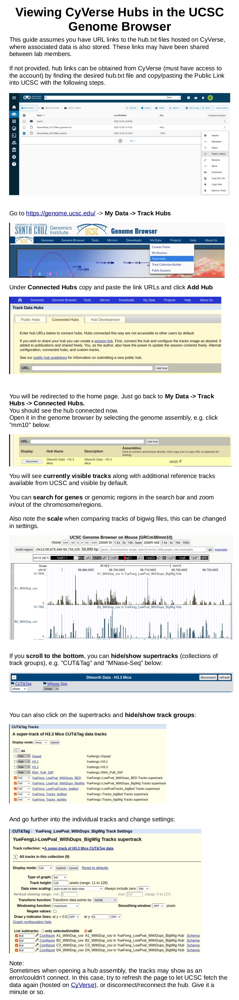

# Data Management  
  
## Archiving  
  
Raw reads fastq.gz files, processed bigwigs, bed, and other genome coverage files from experiment results should all be <ins>backed up for archiving</ins>.  
Currently, this location is the <ins>**WISC ResearchDrive**</ins>, please contact the appropriate person to transfer any new data and keep this updated.  

Additionally, feel free to maintain your own data backed up as a redundancy which you can also manipulate for analysis.  

___  

## Access and Visibility  

For viewing experiment bigwigs and/or bed files, <a href="https://www.cyverse.org/">CyVerse</a> is used to host this data, while the <a href="https://genome.ucsc.edu/">UCSC Genome Browser</a> connects to CyVerse to display the data.  

You may obtain access to Jeff Dilworth's CyVerse account with his permission, or create a free account; however, Jeff's account also acts as a central location for archived data to be viewable.  

A UCSC account is not required, but allows convenience to save connected hubs and sessions for viewing hubs/tracks anytime without having to set them up again.  

Typical steps for viewing after obtaining bigwigs/bed files:  
<ol>  
  <li>Upload files to CyVerse in appropriate locations</li>  
  <li>Create/update trackDb.txt, genomes.txt, hub.txt files</li>  
  <li>Connect hub.txt public link to UCSC browser</li>  
  <li>View data</li>  
</ol>  
   

